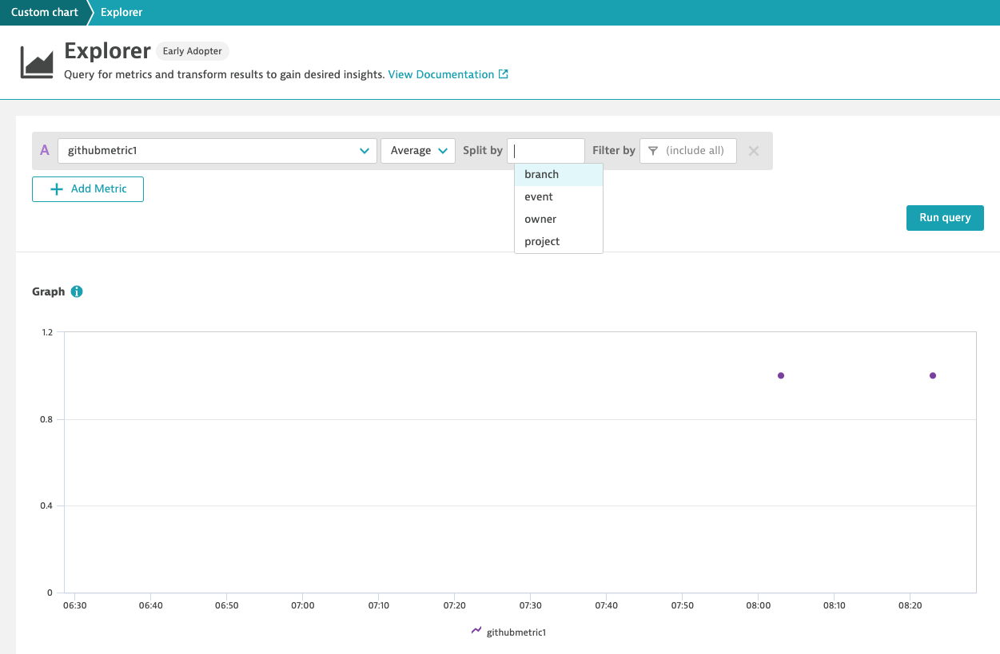
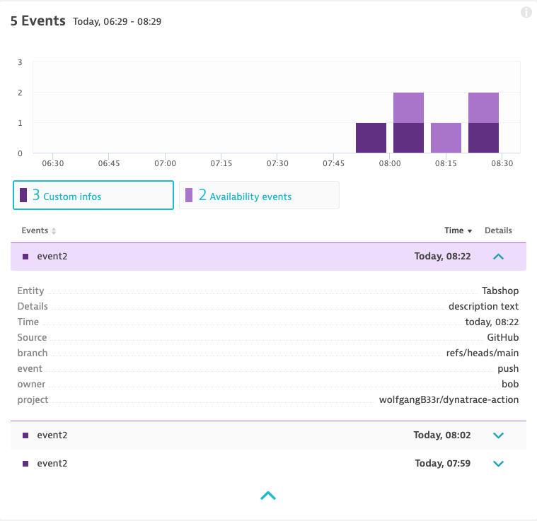

# Dynatrace Action

[](https://github.com/actions/typescript-action/actions)

This Action lets you send events and metrics to a Dynatrace monitoring environment from a GitHub workflow.

## Usage

The action can send metrics and events to any Dynatrace environment by setting the `url` and `url` param.

Please note how `metrics` and `events` is configured as a string containing YAML code - this
allows to send more than one metric or event at once.
To send a metric, configure a job step like the following:

```yaml
- name: Build count
  uses: wolfgangB33r/dynatrace-action@v4
  with:
    url: '${{ secrets.DT_URL }}'
    token: '${{ secrets.DT_TOKEN }}'
    metrics: |
      - metric: "github.metric1"
      value: "1.0"
      dimensions:
        project: "${{ github.repository }}"
        branch: "${{ github.ref }}"
        event: "${{ github.event_name }}"
        owner: wolfgang
```

Analyze the resulting CI/CD pipeline metric within Dynatrace, as shown below:


You can also send Dynatrace events from workflows, same as `metric` please note
how `events` is configured as a string containing YAML code.
To push an event onto an entity, either a list of entity ids is necessary or 
one or more tag query statements. A tag query statement always contains the type of
the entity to search for (HOST) followed by a ':', a tag key and optionally followed by 
':' and a tag value.  
For example, to send an event whenever a job has failed:

```yaml
steps:
  - name: checkout
    uses: actions/checkout@v2
  - name: build
    run: this-will-fail
  - name: Notify Dynatrace on Build Failed
    if: failure()
    uses: wolfgangB33r/dynatrace-action@v4
    with:
      url: '${{ secrets.DT_URL }}'
      token: '${{ secrets.DT_TOKEN }}'
      events: |
        - title: "Build failed"
          type: CUSTOM_INFO
          description: "Branch ${{ github.ref }} failed to build"
          source: GitHub
          tags:
            - SERVICE:MyApp
            - HOST:MyApp:value
          entities:
            - HOST-12345678
            - SERVICE-123212231
          dimensions:
            project: "${{ github.repository }}"
            branch: "${{ github.ref }}"
            event: "${{ github.event_name }}"
            owner: ${{ github.repository_owner }}
```

Find the resulting CI/CD pipeline events within Dynatrace, as shown below:


## Development

Install the dependencies

```bash
$ npm install

up to date, audited 1004 packages in 3s
```

Lint, test and build the typescript and package it for distribution

```bash
$ npm run all

> typescript-action@0.0.0 all
> npm run build && npm run format && npm run lint && npm run package && npm test
...
```

Run the tests :heavy_check_mark:

```bash
$ npm test

> typescript-action@0.0.0 test
> jest

ts-jest[versions] (WARN) Version 4.0.2 of typescript installed has not been tested with ts-jest. If you're experiencing issues, consider using a supported version (>=2.7.0 <4.0.0). Please do not report issues in ts-jest if you are using unsupported versions.
 PASS  __tests__/main.test.ts (8.316s)
  ✓ throws invalid number (15ms)
  ✓ wait 500 ms (500ms)

Test Suites: 1 passed, 1 total
Tests:       2 passed, 2 total
Snapshots:   0 total
Time:        9.336s
Ran all test suites.
```
